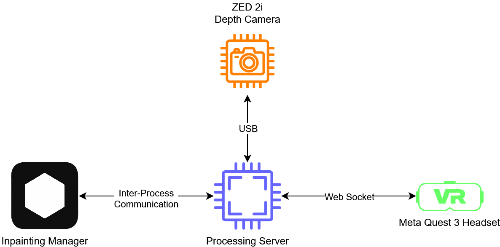
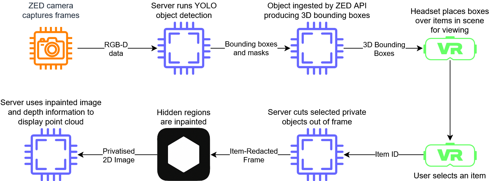

# AIO_server

All-In-One (AIO) Server for Real-Time Diminished Reality and Mixed-Reality Privacy Systems.  
This repository contains the orchestration layer that connects computer vision, inpainting, ZED stereo depth sensing, segmentation, and headset-based visualization into a single pipeline.  

The system achieves **real-time object-level privacy redaction** by managing camera inputs, running segmentation models, performing inpainting, and streaming results to a mixed-reality headset for interactive visualization.

---

## ✨ Features & Achievements

- **Custom ZED Camera Manager**  
  Efficiently manages stereo camera input streams, including depth maps and color frames, optimized for GPU pipelines.

- **Segmentation Engine**  
  Runs YOLO-based segmentation models (TensorRT optimized) to detect objects for redaction or interaction.

- **Inpainting Pipeline**  
  Uses a transformer-based video inpainting model (DSTT-style) to remove or obscure selected objects while maintaining temporal consistency.

- **IPC Connection Manager for Communication with Inpainting Server**
  High-performance shared memory and event signaling system for inter-process communication between modules (camera, segmentation, inpainting, visualization).

- **Headset Socket Manager**  
  Handles bidirectional communication with the Meta Quest headset, enabling the user to select objects in real time and see redaction applied interactively.

- **3D Visualization Layer**  
  Uses OpenGL to visualise the resulting privatised point cloud.

- **Unified Program Logic**  
  Orchestrates data flow between components, ensuring low-latency operation and synchronized updates across camera, AI models, and visualization.

---

## 🧩 Components Overview

### ZED Camera Manager
- Interfaces with the ZED 2i/other ZED cameras.  
- Provides synchronized **RGB + depth maps**.  
- Prepares data for segmentation and redaction.

### IPC Connection Manager
- Implements **shared memory** blobs for efficient GPU↔CPU↔Unity data transfer.  
- Uses Windows events (or platform equivalents) for signaling readiness.  
- Avoids file I/O latency by directly exchanging memory buffers.

### Segmentation Engine
- TensorRT-optimized YOLO engine for **real-time object detection**.  
- Outputs bounding boxes, masks, and object IDs to drive the privacy logic.

### Headset Socket Manager
- WebSocket/TCP-based interface between Unity running on the Meta Quest and the PC backend.  
- Allows headset users to **interactively select/deselect objects** for redaction.  
- Updates Unity visualization with live bounding boxes and inpainted outputs.

---

## ⚙️ Requirements

### Hardware
- **NVIDIA GPU** (RTX 3070 or higher recommended).  
- **ZED 2i Stereo Camera**.  
- **Meta Quest 3** (or compatible headset).

### Software
- **Windows 10/11**
- [ZED SDK](https://www.stereolabs.com/developers/) (v4.0+)
- [CUDA Toolkit](https://developer.nvidia.com/cuda-downloads) (12.1 recommended).  
- [TensorRT](https://developer.nvidia.com/tensorrt) (v10.7). 
- CMake, MSVC (for compiling C++ components).
- Visual Studio 2022

### Dependencies
- OpenCV (`opencv_world` for C++ integration).  
- uwebsockets
- Custom-built TensorRT `.engine` files for segmentation and inpainting.
- YOLO segmentation engine (yolov11m-seg.engine)

---

## 🚀 Running the Server

The current implementation has been found to work by building using Visual Studio.
Make sure to build for Release for successful compilation.

Once the application has been launched, ensure that the inpainting server is also running, and open the application on the Quest headset to begin the selection and removal of items.

## 🔍 How It Works (Pipeline)

---

## 🏆 Achievements

- End-to-end real-time privacy redaction system for mixed reality.
- Achieved GPU-accelerated inpainting at interactive framerates (360p→720p).
- Seamless Unity headset integration with interactive object selection.
- Modular architecture: each component can be swapped, improved, or scaled.
- Foundation for research into privacy-preserving MR meetings and diminished reality.

## 📜 License
MIT License
